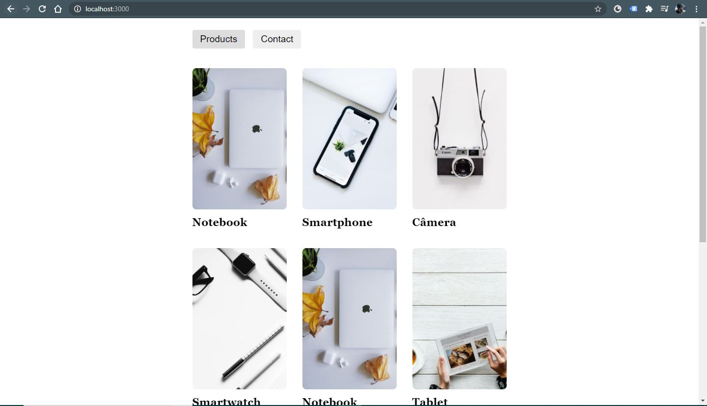
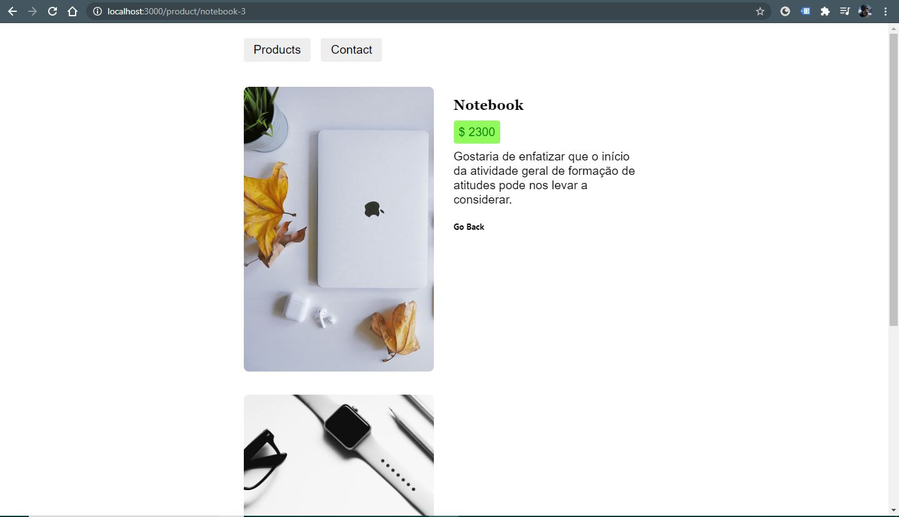
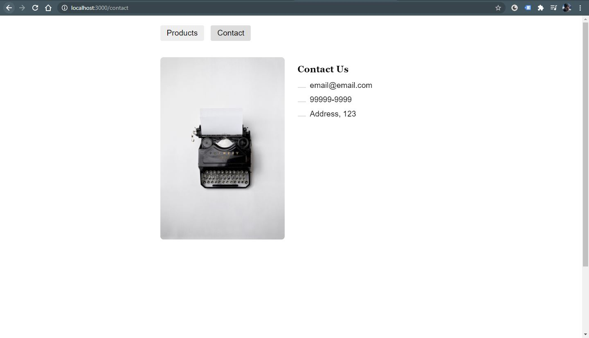
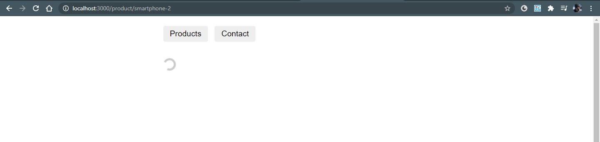

# Getting Started with React Router

<table>
  <tr>
    <td align="center">
         
    </td>
    <td align="center">
         
    </td>
    <td align="center">
         
    </td>
    <td align="center">
         
    </td>
  </tr>
</table>

 

This project was a case study of React Router. Includes:
- Router
- Link and NavLink
- Nesting
- URL Parameters
- Head Tags (Title and Meta)
- Animated Transitions
- Loading
- Async Fetch

In the project directory, you can run:

### `npm start`

Runs the app in the development mode.\
Open [http://localhost:3000](http://localhost:3000) to view it in the browser.

